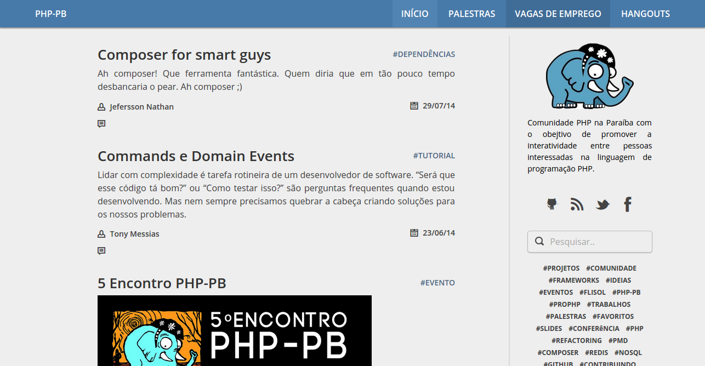

Novo layout PHP-PB
==================

Pŕe-visualização
----------------
### Início ###

### Paginação ###

### Pesquisa ###

Sass e Compass
--------------
Boa parte dos atributos, como cor de fundo, tamanho e cor da fonte podem ser modificados no arquivo `_scss/_variables.scss`

Menu de navegação
-----------------
Modificar chave `navigation` no _config.yml:
	
	navigation:
		- text: 'exemplo'
		  url: '/exemplo'

Aprimorar
---------
- Implementar Disqus
- Visualização mobile